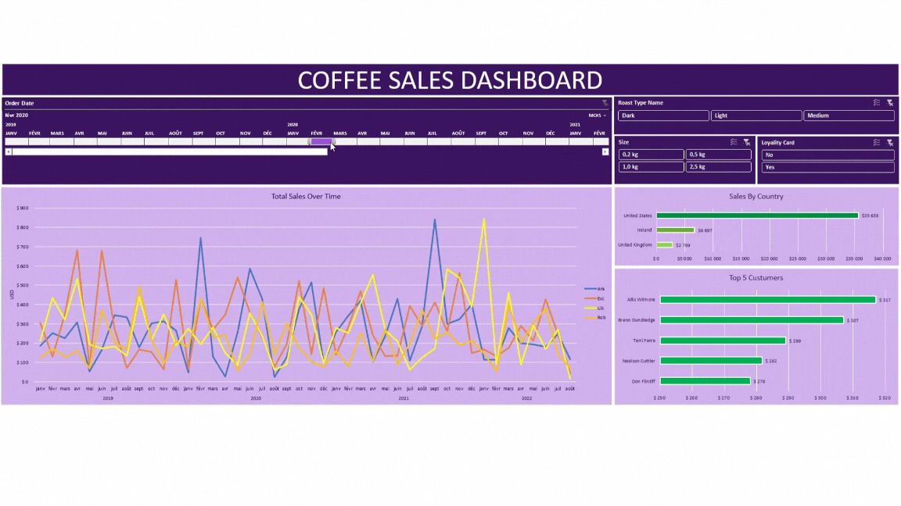

# **Coffee Sales Dashboard**

# Introduction

The Coffee Sales Dashboard has been created to analyse coffee sales data and provide useful insights into sales trends, customer preferences and product performance.

## Dashboard File
My final dashboard is in [Coffee_sales_dashboard.xlsx](Coffee_sales_dashboard.xlsx).

## Tools I Used

The following Excel skills were used to analyse and create the dashboard:
- 📊 Charts
- 🧮 Formulas and Functions such as INDEX or XLOOKUP
- 🔢 Pivot Tables
- 🎯 Segmentation and Interactivity

## Data used

The data comes from  comprising three data sheets:
- **Orders:** Contains information on orders.
- **Customers:** Details customer information.
- **Products:** Provides product information.

# Dashboard construction

### 1. Sales Timeline

- Use a timeline to display all sales dates.
- Interactive graph showing sales trends over time

### 2. Sales by Roast Type

- Interactive slicer based on roast type to filter data according to customer preferences.

### 3. Sales by Size

- Interactive slicer on product size to analyse the impact of size on sales.

### 4. Loyalty Card

- Interactive slicer for analysing sales to customers with a loyalty card compared with those without.

### 5. Sales by Coffe Type

- Pivot chart showing sales trends by coffee type (e.g. Robusta, Excelsa, Arabica, Liberica).
- Shows sales trends by coffee type.

### 6. Sales by Country

- Bar chart showing the number of sales by country, to identify key markets.

### 7. Top 5 Customers

- Bar graph illustrating the 5 largest customers in terms of sales volume, to identify the most important customers.

# Conclusion

This dashboard has been designed to provide a comprehensive view of coffee sales, enabling users to analyse sales trends, understand customer preferences and identify the most profitable products and markets. Using Excel, this project provides an interactive and dynamic solution for data-driven decision-making.